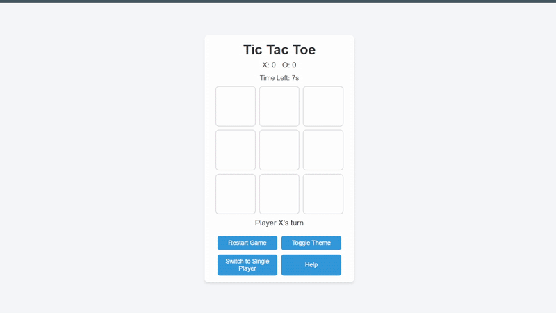

# Tic Tac Toe - Enhanced Compact Experience

## Live Demo (aitoe.netlify.app)

## Description
This project is a modern, self-contained Tic Tac Toe game built using plain HTML, CSS, and JavaScript. It offers a compact and engaging experience featuring a dynamic UI, move timers, and a perfect-play AI powered by the minimax algorithm. The game supports both Two Player and Single Player modes with a dark theme toggle for visual variety. Check out the main file in [index.html](./index.html).

## Demo Video

## Interesting Techniques
- **CSS Variables for Theming:** Uses custom properties to define theme colors, enabling easy theme toggling. Learn more on [MDN CSS Custom Properties](https://developer.mozilla.org/en-US/docs/Web/CSS/--*).
- **Responsive Layout with CSS Grid:** The game board is built using CSS Grid for a responsive and clean layout. See [MDN CSS Grid](https://developer.mozilla.org/en-US/docs/Web/CSS/grid).
- **CSS Animations & Transitions:** Implements animations for cell moves (using keyframes like `pop`) and an animated RGB cycling winning line ([MDN CSS Animation](https://developer.mozilla.org/en-US/docs/Web/CSS/animation), [MDN CSS Transition](https://developer.mozilla.org/en-US/docs/Web/CSS/transition)).
- **Timer Management:** Uses JavaScript’s `setInterval` to handle a countdown for each move. More info on [MDN setInterval](https://developer.mozilla.org/en-US/docs/Web/API/setInterval).
- **Minimax Algorithm for AI:** A minimax implementation ensures perfect play in Single Player mode. For details, refer to the [Wikipedia Minimax Algorithm](https://en.wikipedia.org/wiki/Minimax).

## Non-Obvious Technologies & Libraries
- **Modern JavaScript (ES6):** Utilizes features like arrow functions, `const`/`let`, and template literals for cleaner, modular code.
- **Dark Theme Toggle:** Implements a dark theme via a simple CSS class toggle, enhancing user experience.
- **Modal Dialog for Help:** The help section is implemented as a modal overlay, providing in-game instructions without leaving the page.
- **Perfect-Play AI:** Integrates a minimax algorithm for competitive single-player gameplay.
